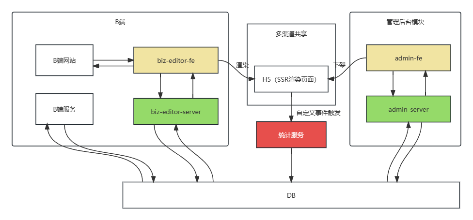
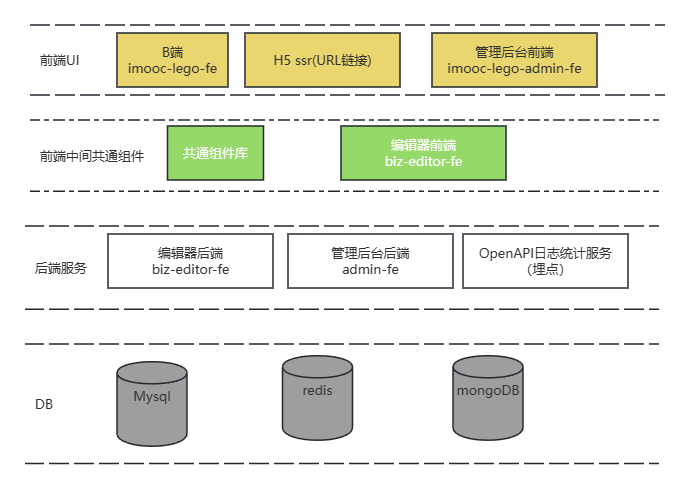

# 整体架构设计文档V1.0

### 一、需求
 [需求地址](https://imooc-lego.yuque.com/imooc-lego/zlz87z)

### 二、范围（整体架构）
1. 根据需求分为：B端和编辑器，H5分享，统计服务（OpenApi自研）,管理后台
2. B端：用户注册、登录、编辑器提供创作，修改，预览，分享功能
3. H5模板分享：提供分渠道统计功能
4. 管理后台：用户管理模块，发布，下架控制，pv/uv的统计所有分享页面的监控。


### 三、模块设计（模块关系，结果，功能，职责）
1. B端和编辑器，做前后端分离
2. URL作品分享H5页面，考虑性能问题，这里采用SSR服务端渲染的方式，这里存在自定义事件触发，渠道统计数据
3. 管理后台，【用户管理，作品管理，模板管理，数据统计分析（pv/uv数据）】
 

### 作品数据结构
  1. 定义作品的数据结构，也就是DTO


```js
// vuex state 数据结构定义
  {
    work:{
        title:'作品名称',
        settings:{}, // 扩展配置，增加全局配置
        props:{}, // 作品扩展属性设置 
        components:[ // 此处使用数组形式可以制定
            {
                id:'1', // 组件ID 保证唯一性 
                name: '组件名称', // 组件名称
                tag:"text" // 组件标签类型 ,可枚举类型为 text,shape,image,
                attrs:{
                    fontSize:'20px', // 字体大小
                    color:"字体颜色" // 字体颜色,
                    x:0, // 组件所在位置x坐标
                    y:0,// 组件所在位置y 坐标
                    width:'100px' // 组件宽度
                    height:'100px'， // 组件高度
                    ...
                },
                // 是否内嵌组件
                children:[]
            },
            ...
        ]
    },
    // 画布当前选中的组件
    activeComponentId:''
  }

//  图层通过计算属性获取 vuex getters 返回计算属性
layers()=>{
    store.work.componets.map(c=>{
        return {
            id:c.id,
            name:c.name
        }
    })
}
```

### 扩展性保证（待补充）
- 扩展组件，数据结构层面
- 扩展编辑器的功能，例如：组件隐藏、锁定
- 扩展页面配置，如增加多语言，设置背景，支持主题设置
- 扩展其他功能，如大数据分析和计算等
- 

### 开发提效（待补充）
- 脚手架： 创建，项目开发，git操作，测试，发布
- 共通组件平台
  
### 运维保障（待补充）
- 线上服务和运维服务
- 安全
- 监控和报警
- 服务扩展性：流量大时，基于云服务，可以随时扩展机器和配置
